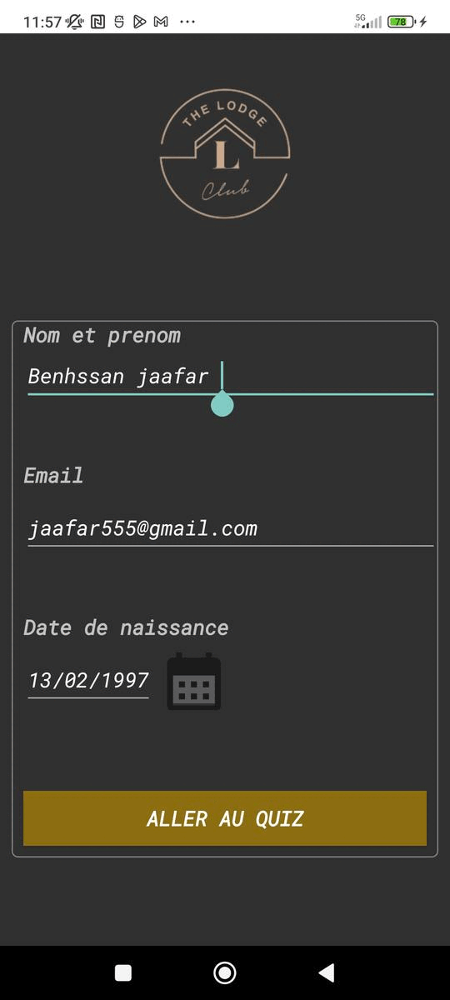

[](http://kotlinlang.org)

# Basic UI



# The Lodge  :
The Android application developed in Kotlin, called the The Lodge, uses a welcome activity to enable the user to sign up. After the registration process is complete, the user can use a [Recycler View](https://developer.android.com/studio](https://developer.android.com/reference/kotlin/androidx/recyclerview/widget/RecyclerView) to select the quiz's subject matter.

Upon choosing the theme, the user navigates to the questionnaire through tabs located at [the bottom of the screen (https://developer.android.com/reference/com/google/android/material/bottomnavigation/BottomNavigationView). The questionnaire is divided into two separate fragments for questions and answers.

When participating in the quiz, the user will receive a score based on the number of correctly answered questions. This score can be represented using a progress bar or expressed as a percentage.

Overall, the app provides an intuitive experience for users seeking to take quizzes on various subjects.

# Getting started  :
This is an Android project made with [Kotlin language](https://kotlinlang.org/docs/home.html).
 . 
 ### Installation 1. Clone the repo
 Install [Android Studio](https://developer.android.com/studio) and create a new Project From Version Control and paste clone.
 
 
   ```sh
   git clone https://github.com/Jaff5090/The-Lodge-.git
   ```
   
# Dependencies: 

## Libraries


# contact: 

* BENHSSAN Jaafar  : https://www.linkedin.com/in/jaafar-benhssan-781328195/
* Abdoularaman Kamara  : https://www.linkedin.com/in/kamara-abdulrahman-906438200/  


