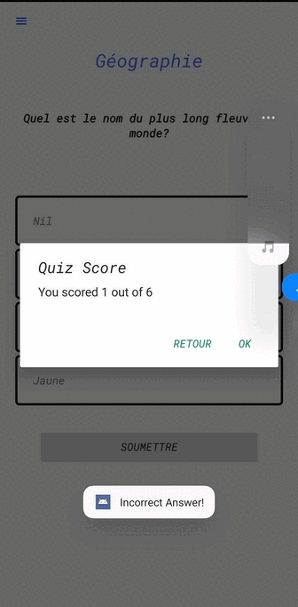

[](http://kotlinlang.org)

# Basic UI

<p float="left">
   
  <h3>The Lodge:</h3>
  <p>The Android application developed in Kotlin, called the The Lodge, uses a welcome activity to enable the user to sign up. After the registration process is complete, the user can use a Recycler View to select the quiz's subject matter.</p>
  <p>Upon choosing the theme, the user navigates to the questionnaire through tabs located at the bottom of the screen . The questionnaire is divided into two separate fragments for questions and answers.</p>
  <p>When participating in the quiz, the user will receive a score based on the number of correctly answered questions. This score can be represented using a progress bar or expressed as a percentage.</p>
  <p>Overall, the app provides an intuitive experience for users seeking to take quizzes on various subjects.</p>
</p>


# Getting started  :
This is an Android project made with [Kotlin language](https://kotlinlang.org/docs/home.html).
 . 
 ### Installation 1. Clone the repo
 Install [Android Studio](https://developer.android.com/studio) and create a new Project From Version Control and paste clone.
 
 
   ```sh
   git clone https://github.com/Jaff5090/The-Lodge-.git
   ```
   
# Dependencies: 
numpy==1.18.5
pandas==1.0.4
matplotlib==3.2.2
flask==1.1.2


## Libraries


# contact: 

* BENHSSAN Jaafar  : https://www.linkedin.com/in/jaafar-benhssan-781328195/
* Abdoularaman Kamara  : https://www.linkedin.com/in/kamara-abdulrahman-906438200/  


